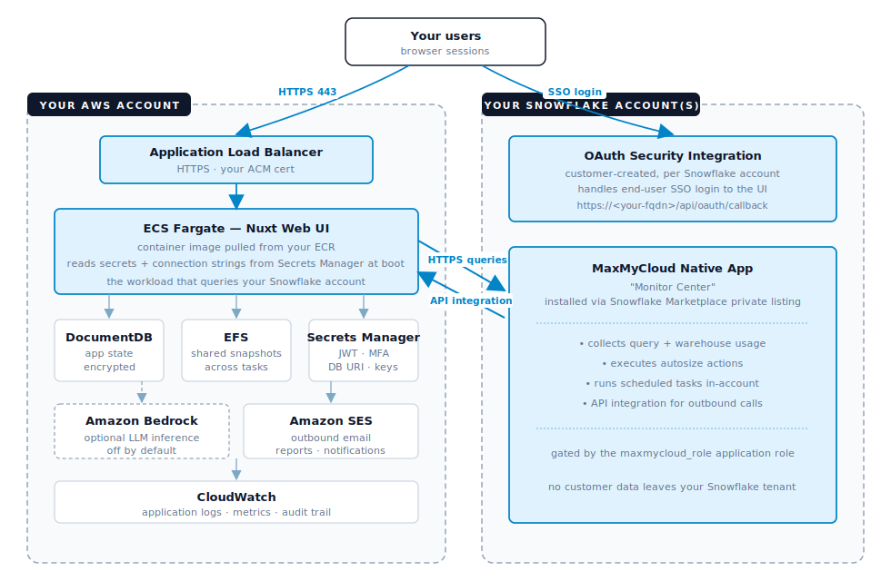

# MaxMyCloud — Customer Installation Guide (AWS deployment)

This is the end-to-end runbook for installing MaxMyCloud in your own tenants. It covers **both** the Snowflake side (Native App) and the AWS side (web UI + supporting services), then walks through the first-connection setup that ties the two together.

Read this document top-to-bottom the first time. On repeat installs (adding a second Snowflake account, redeploying to another environment), you can skip the parts already done.

**Time estimate:** ~90 minutes end-to-end, mostly Terraform waiting on DocumentDB provisioning. Hands-on work is closer to 30 minutes if your AWS account already has SES set up and your Snowflake admin is on standby.

---

## Quick reference

Everything you'll need a URL, name, or contact for, in one place. Bookmarkable — the rest of the doc points here.

| Thing | Where |
|---|---|
| **Terraform deploy repo (this doc lives here)** | `https://github.com/maxmycloud/maxmycloud-deploy` — public, anonymous clone |
| **AWS runbook path (this doc)** | `deployment/aws/customer/INSTALL_GUIDE.md` |
| **AWS Terraform reference (deeper)** | `deployment/aws/customer/DEPLOY.md` |
| **Container image registry** | `ghcr.io/maxmycloud/maxmycloud-ui:<version>` — public, anonymous `docker pull` |
| **Latest release version** | `v0.3.17` (check `github.com/maxmycloud/maxmycloud-deploy/releases` for newer) |
| **Snowflake Native App name** | `Monitor Center` — appears under Snowsight → Data Products → Apps → Recently Shared |
| **Onboarding + support** | `support@maxmycloud.com` |
| **Enterprise escalation** | `richard.yan@maxmycloud.com` |

---

## What you're installing

MaxMyCloud lives in two customer-owned tenants:

1. **Inside your Snowflake account** — the "Monitor Center" Native App, delivered to your Snowflake organization via private Marketplace listing. It gathers query + warehouse usage, executes autosize actions, and exposes them via an in-account API integration.
2. **Inside your AWS account** — a Nuxt web UI on ECS Fargate, backed by DocumentDB (state), EFS (shared snapshots), Secrets Manager (keys), and — optionally — Amazon Bedrock (LLM inference). Terraform provisions the whole stack in ~20 minutes.

The AWS-side UI queries your Snowflake Native App over HTTPS. No third-party service sits in the middle; both tenants stay in your accounts.

### Architecture at a glance



**How it fits together:**

- **Your users' browsers** → the Application Load Balancer over HTTPS. All UI traffic terminates in your AWS account.
- **User SSO login** goes through the OAuth Security Integration inside your Snowflake account — the MaxMyCloud UI never sees Snowflake user passwords.
- **ECS ↔ Native App** carries the main data channel: HTTPS queries out from the UI, API-integration callbacks back in. Both endpoints live in your tenants; no third-party service sits in between.
- **Bedrock** (dashed border) is optional LLM inference — off by default until you opt in. **SES** handles outbound email (health-check reports, alerts).
- **CloudWatch** captures every application log line and metric for your existing SIEM / observability stack.

---

## Prerequisites

Do all of these before starting. Most enterprise AWS accounts already satisfy the AWS-side items.

### On the Snowflake side

- A Snowflake admin who can (a) share your account identifier(s) with MaxMyCloud and (b) install the Native App once it's published to each account.
- You may have more than one Snowflake account you want MaxMyCloud to monitor (prod, dev, business unit accounts, etc.). Repeat Part 1 of this guide for **each** account — MaxMyCloud publishes the Native App per-account, and the connection setup in the UI is per-account.

### On the AWS side

- An IAM user or SSO role with permission to create VPC, ECS, DocumentDB, ALB, EFS, Secrets Manager, IAM, ACM. `AdministratorAccess` for the initial install is simplest; scope down after.
- A verified SES sender identity (domain or email address). If your SES account is still in sandbox mode, request production access — one AWS Support ticket, typically approved within 24 hours.
- A hostname you own that will point at the ALB (e.g. `maxmycloud.internal.acme.com`) plus one of:
  - A Route 53 hosted zone (Terraform issues an ACM cert automatically), **or**
  - An existing ACM certificate in the deploy region.
- **(Optional, only if you plan to enable AI)** Bedrock model access. Amazon Nova family is instant; Anthropic Claude requires a one-time use-case form.

### On your workstation

- Terraform ≥ 1.5, AWS CLI v2, Docker, and (recommended) OpenSSL for generating the Snowflake key pair.

---

## Part 1 — Snowflake side

> **Do Part 1 once per Snowflake account you want MaxMyCloud to monitor.** If you have two prod accounts and a dev account, you'll run through this section three times. Each account gets its own Native App install, its own role, its own service user + key pair, and its own OAuth Security Integration for user SSO.

MaxMyCloud connects to Snowflake using **two** independent auth surfaces, both of which need to be set up:

- **Key-pair authentication** — a service-account credential used only by MaxMyCloud's own backend processes (scheduled health checks, ongoing warehouse monitoring, autosize actions, subscription refresh). It runs as a dedicated `maxmycloud` service user. **No human logs in with key-pair auth** — the private key never leaves the app's Secrets Manager.
- **OAuth Security Integration** — how your end-users sign in to the MaxMyCloud UI, with their own Snowflake identity (SSO). Users authenticate as themselves through Snowflake's OAuth flow; the app never sees their password.

### 1.1 · Share your Snowflake account identifier(s) with MaxMyCloud

For **each** Snowflake account you want MaxMyCloud to monitor, run this in a worksheet:

```sql
SELECT CURRENT_ORGANIZATION_NAME() || '.' || CURRENT_ACCOUNT_NAME();
```

Send **all** the results to your MaxMyCloud contact (or `support@maxmycloud.com`). We publish the Native App private listing to each of the listed accounts. Turnaround is typically same-business-day per account.

You'll get an email from us confirming the listing is live in each account.

### 1.2 · Install the Native App

In Snowsight, sign in as an admin who can install applications:

1. Navigate to **Data Products → Apps** in the left navigation.
2. Under **Recently Shared**, find **Monitor Center (MaxMyCloud)**.
3. Click **Get**, review the privileges, then **Install**.

Snowflake creates the application (default name: `monitor_center`). It's now running inside your account.

### 1.3 · Create the role for the MaxMyCloud UI

The UI uses a dedicated Snowflake role — `maxmycloud_role` — to query the Native App and read the warehouse metadata it needs. Run this in a worksheet as `ACCOUNTADMIN`:

```sql
CREATE ROLE maxmycloud_role;
GRANT APPLICATION ROLE monitor_center.app_maxmycloud   TO ROLE maxmycloud_role;
GRANT USAGE ON WAREHOUSE your_warehouse                TO ROLE maxmycloud_role;
GRANT USAGE ON INTEGRATION MAXMYCLOUD_API_INTEGRATION  TO ROLE maxmycloud_role;
GRANT IMPORTED PRIVILEGES ON DATABASE SNOWFLAKE        TO ROLE maxmycloud_role;
```

Replace `your_warehouse` with the warehouse you want MaxMyCloud to use for its own queries. A small warehouse (X-Small or Small) is usually sufficient.

### 1.4 · Create the Snowflake service user (key-pair auth)

MaxMyCloud's backend processes — scheduled health checks, ongoing warehouse monitoring, autosize actions, subscription refresh — authenticate to this Snowflake account as a dedicated `maxmycloud` service user, using a **key pair**. Key-pair auth is the standard Snowflake pattern for machine-to-machine access: the key never appears in a login prompt, never expires on a schedule, and never rotates through the user-password channel. No human logs in with this credential; end users authenticate separately through the OAuth Security Integration in Part 1.5.

**Generate a key pair locally:**

```bash
openssl genrsa 2048 | openssl pkcs8 -topk8 -inform PEM -out rsa_key.p8 -nocrypt
openssl rsa -in rsa_key.p8 -pubout -out rsa_key.pub
```

You'll get two files: `rsa_key.p8` (private, keep safe) and `rsa_key.pub` (public, goes into Snowflake). Store the private key somewhere secure — you'll hand it to MaxMyCloud for the first-account bootstrap in Part 3.

**Create the Snowflake user:**

```sql
CREATE OR REPLACE USER maxmycloud
  PASSWORD          = ''              -- empty for key-pair auth
  LOGIN_NAME        = 'maxmycloud'
  DISPLAY_NAME      = 'maxmycloud'
  DEFAULT_WAREHOUSE = 'your_warehouse'
  DEFAULT_ROLE      = 'maxmycloud_role'
  DISABLED          = FALSE;

GRANT ROLE maxmycloud_role TO USER maxmycloud;
```

**Assign the public key** — open `rsa_key.pub`, copy the content **between** the `-----BEGIN PUBLIC KEY-----` and `-----END PUBLIC KEY-----` lines (single block, no line breaks), and run:

```sql
ALTER USER maxmycloud SET RSA_PUBLIC_KEY='MIIBIjANBgkqh...';
```

### 1.5 · Create the OAuth Security Integration (for user SSO)

This is what lets your end-users log in to the MaxMyCloud UI with their Snowflake identity. The redirect URI must match the hostname you're deploying the UI at (from `terraform.tfvars` → `fqdn`).

Run as `ACCOUNTADMIN`:

```sql
CREATE SECURITY INTEGRATION maxmycloud
  TYPE                = OAUTH
  ENABLED             = TRUE
  OAUTH_CLIENT        = CUSTOM
  OAUTH_CLIENT_TYPE   = 'CONFIDENTIAL'
  OAUTH_REDIRECT_URI  = 'https://<your-fqdn>/api/oauth/callback'
  OAUTH_ISSUE_REFRESH_TOKENS = TRUE
  OAUTH_REFRESH_TOKEN_VALIDITY = 7776000;
```

Then retrieve the OAuth client id + secret — you'll hand these to MaxMyCloud for the first-account bootstrap:

```sql
SELECT SYSTEM$SHOW_OAUTH_CLIENT_SECRETS('MAXMYCLOUD');
```

Copy `OAUTH_CLIENT_ID` and `OAUTH_CLIENT_SECRET` from the returned JSON — treat both as secrets.

**Summary of what you've now created for this account** — the Native App, the role + grants, a key-pair service user, and an OAuth Security Integration. Repeat all of Part 1 for the next Snowflake account. When done, gather everything you'll need to hand off in Part 3:

- Account identifier (`<org>-<acct>`)
- Warehouse name
- `rsa_key.p8` (private key file)
- `OAUTH_CLIENT_ID`
- `OAUTH_CLIENT_SECRET`

---

## Part 2 — AWS side

The AWS side is delivered as a Terraform module in a public GitHub repository. All resources are created inside your AWS account.

### 2.1 · Clone the deploy repo

```bash
git clone https://github.com/maxmycloud/maxmycloud-deploy.git
cd maxmycloud-deploy/deployment/aws/customer
```

Anonymous clone — no GitHub authentication required.

### 2.2 · Configure `terraform.tfvars`

```bash
cp terraform.tfvars.example terraform.tfvars
$EDITOR terraform.tfvars
```

The variables you must set:

| Variable | What to enter |
|---|---|
| `region` | Your AWS region (e.g. `us-east-1`) |
| `fqdn` | The hostname you own that will front the app |
| `acm_certificate_arn` **or** `route53_zone_id` | Certificate path — set one |
| `tenant_client_id` | Provided by MaxMyCloud (identifies your tenant to the app) |
| `tenant_display_name` | Your company name — shown on the login page |
| `email_from_address` | A verified SES sender in this account |
| `container_image` | Leave as-is for now; you'll update it in Step 2.4 |

Defaults for everything else are sensible for a single-tenant enterprise install. See `variables.tf` for the full list.

### 2.3 · Run Terraform

```bash
terraform init
terraform apply
```

Review the plan (~58 resources on a fresh install), type `yes`. The DocumentDB cluster provisioning is the slow step — plan on ~15 minutes.

When apply finishes, capture the outputs:

```bash
terraform output
```

The important ones are `ecr_repository_url` (where you'll push the container image), `alb_dns_name` (where the app will be reachable once configured), and the secret ARNs for the app secrets you need to populate next.

### 2.4 · Populate the application secrets

Terraform creates empty Secrets Manager entries; you populate the values (so no secret material sits in Terraform state). For each secret:

```bash
aws secretsmanager put-secret-value \
  --secret-id <secret-arn-from-output> \
  --secret-string "$(openssl rand -base64 32)"
```

Populate the following three, all with random 32-byte values:

| Secret | What it protects |
|---|---|
| `NUXT_JWT_SECRET` | Signs the session tokens issued after a user logs in via SSO. |
| `passwordEncryptionKey` | AES-256 encryption key for the Snowflake service-user private key you stored in the UI's Snowflake account records (Part 3). Without this the app cannot decrypt its own connection credentials. |
| `NUXT_MFA_SECRET_KEY` | Encryption key for MFA seeds. Not exercised in SSO-only mode (Snowflake handles second-factor per your Snowflake auth policy), but the container still expects the secret to be present at boot. Set it to a random value and move on. |

### 2.5 · Push the container image

Log in to your ECR:

```bash
aws ecr get-login-password --region <region> | \
  docker login --username AWS --password-stdin <ecr-registry>
```

Pull the latest MaxMyCloud release from the public registry, retag for your ECR, and push:

```bash
docker pull ghcr.io/maxmycloud/maxmycloud-ui:v0.3.17
docker tag ghcr.io/maxmycloud/maxmycloud-ui:v0.3.17 <ecr-repo>:v0.3.17
docker push <ecr-repo>:v0.3.17
```

Update `container_image` in `terraform.tfvars` to the full image URI you just pushed, then re-apply:

```bash
terraform apply
```

ECS starts the new task-def revision. The service takes 2–3 minutes to become healthy.

### 2.6 · Point DNS at the ALB (if not using Route 53 auto-issue)

If you provided your own ACM cert (`acm_certificate_arn` set) with external DNS, create a CNAME/A-record in your DNS provider pointing your `fqdn` at the `alb_dns_name` from the Terraform outputs. Route 53 users: Terraform already did this.

You should now be able to reach `https://<your-fqdn>` in a browser and see the MaxMyCloud sign-in page.

For a deeper reference on any of the AWS steps (bring-your-own cert options, secret rotation, HA scaling, Bedrock IAM, teardown), see `DEPLOY.md` in the same directory.

---

## Part 3 — First-account bootstrap (MaxMyCloud runs this with you)

The AWS side is up, but you can't log in to it yet — the UI requires a Snowflake OAuth connection to authenticate users, and no connection is registered. **MaxMyCloud handles this initial bootstrap for you**, because it's a chicken-and-egg problem: registering the first Snowflake connection requires being signed in as an admin, and there is no admin yet. Delivery is your choice — a scheduled screen-share with a MaxMyCloud engineer, or fully asynchronous online (we sign in via support-access, complete the bootstrap, and confirm by email). Either way, hand-off time is ~1 business day.

### 3.1 · Send MaxMyCloud what we need for the first account

Pick **one** of the Snowflake accounts you set up in Part 1 to be the first one wired in — typically your primary prod account. Send its info securely to MaxMyCloud (encrypted email, 1Password share, or whatever your org uses):

| Item | Where it came from |
|---|---|
| **Deploy URL** | `https://<your-fqdn>` from Part 2 |
| **Snowflake account URL** | `https://<org>-<acct>.snowflakecomputing.com` — see Appendix if you need to look it up |
| **Warehouse** | The warehouse granted in Part 1.3 |
| **Service username** | `maxmycloud` (or whatever you named it in Part 1.4) |
| **Private key** | Contents of `rsa_key.p8` from Part 1.4 |
| **OAuth client id + secret** | From Part 1.5 |
| **First admin user's email** | Your Snowflake login email — this is the person who will sign in first |

### 3.2 · MaxMyCloud registers the connection + provisions your first user

A MaxMyCloud engineer will:

1. Sign in to your deploy as a bootstrap admin using our support-access flow.
2. Register your first Snowflake account in the UI using the info above.
3. Enable Snowflake SSO for that account so your users can log in with their Snowflake identity.
4. Grant your first admin user the necessary UI role.
5. Confirm the wiring end-to-end by running a Health Check on your data, and share the result with you (screen-share or email — your choice).
6. Live training on the cost-insight dashboards, real-time monitoring, and warehouse optimization workflows is available on request.

After this step, you own the deploy fully — MaxMyCloud's support-access can be rotated out (see `DEPLOY.md` § Support access).

### 3.3 · Adding more Snowflake accounts yourself

Once the first account is live and you're signed in, adding any additional Snowflake accounts is self-service:

1. Complete Part 1 of this guide for the new account (Native App install, role, service user + key pair, OAuth Security Integration).
2. In the MaxMyCloud UI, navigate to **Settings → Accounts → Add Account**.
3. Fill in the same fields from the table above — account URL, warehouse, service user, private key, OAuth client id + secret.
4. Click **Test Connection**, then **Save**.

The new account appears in your account list and starts collecting data immediately. No MaxMyCloud involvement needed.

### 3.4 · Inviting more MaxMyCloud users

Navigate to **Settings → Users → Add User** in the UI. Invited users sign in through Snowflake SSO — as long as they have a Snowflake account with the OAuth integration enabled, they can log in. You control UI-level role at invite time.

---

## Ongoing operations

Adding more users and Snowflake accounts is covered in Part 3.3 / 3.4 above. Everything below is standard AWS-operator work.

### Turning on AI features

AI ships off by default so you can validate the platform + finish your security review first. The flip is a two-part operation:

**Step A — grant Bedrock model access (AWS Console, one-time):**

1. Open the **Bedrock Console → Model access** in the same AWS account + region as the deploy.
2. Request access to the models named in `bedrock_model_main` and `bedrock_model_fast` (defaults: `us.amazon.nova-pro-v1:0` and `us.amazon.nova-lite-v1:0`). Nova is instant; if you swap to Anthropic Claude, expect a one-time use-case form.
3. Wait for Access status = **Granted** on each model.

**Step B — flip the kill-switch (Terraform, recommended):**

1. Set `ai_features_disabled = false` in `terraform.tfvars`.
2. `terraform apply` — ECS rolls a new task-def revision, no downtime.

> **Why Terraform, not the AWS Console?** The kill-switch is an environment variable on the ECS task definition, which Terraform owns. You *can* edit the task-def revision directly in the ECS Console, and the change will take effect immediately, but the **next** `terraform apply` will overwrite it back to whatever `terraform.tfvars` says. Keep the change in Terraform so your deploy state stays reproducible. (Bedrock model access in Step A stays in the Console — it's an account-level grant Terraform doesn't manage.)

### Upgrading to a new MaxMyCloud release

MaxMyCloud publishes new releases to `ghcr.io/maxmycloud/maxmycloud-ui` on a regular cadence. To upgrade:

```bash
docker pull ghcr.io/maxmycloud/maxmycloud-ui:vX.Y.Z
docker tag  ghcr.io/maxmycloud/maxmycloud-ui:vX.Y.Z <ecr-repo>:vX.Y.Z
docker push <ecr-repo>:vX.Y.Z
```

Update `container_image` in `terraform.tfvars`, then `terraform apply`. ECS rolls the new task-def with zero manual coordination.

### Scaling

- Bump `task_desired_count` in `terraform.tfvars` and re-apply for more UI capacity.
- Set `docdb_instance_count = 2` for a HA DocumentDB pair across AZs.

### Backups

DocumentDB automated backups (7-day retention, point-in-time restore) are enabled by default. Add EFS to AWS Backup if you want redundant coverage of the snapshot volume.

### Teardown

```bash
# In terraform.tfvars, set docdb_deletion_protection = false, then:
terraform destroy
```

Removes everything cleanly. All state lived in your account so nothing persists elsewhere.

---

## Contacting MaxMyCloud

Reach out any time — questions, install help, feature requests, or anything else. We're happy to help.

- `support@maxmycloud.com` — onboarding, operations, general questions
- `richard.yan@maxmycloud.com` — enterprise escalations
